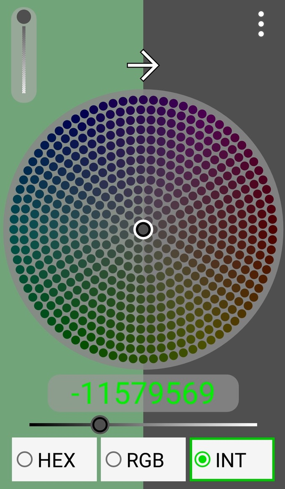

This is an old Android project containing a simple app that allows the users to select two colors and see how they match with eachother.
It allows the user to save colors, it supports three color formats (HEX, RGB, Java color integer) and it supports transparency.

